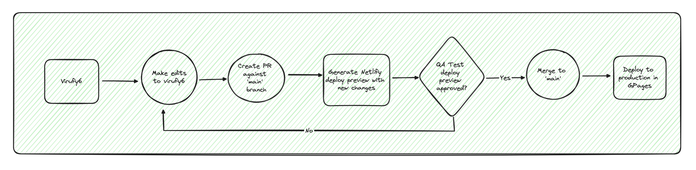

# Decoding hidden patterns in COVID-19 coughs with AI

Virufy is a nonprofit research organization developing artificial intelligence (AI) technology to screen for COVID-19 from cough patterns, rapidly and at no cost through use of a smartphone. To learn more or get involved, visit our [website](https://gevuong.github.io/minimal-i18n-with-app-route).

## Technologies

- Next.js 14.2.4
- React 18
- Typescript 5.5.4
- TailwindCSS 3.4.1
- Netlify
- Github Pages

## Challenges

### Deploying to Github Pages

By default, Next.js uses Node to run applications. Github Pages on the other hand, does not support Node and is designed to host only static HTML pages and assets. Therefore, the Next.js app needed to be [statically exported](https://nextjs.org/docs/app/building-your-application/deploying/static-exports#configuration), but that came with its own challenges.

1. [Static exports does not support internationalized routing with Pages Router](https://nextjs.org/docs/pages/building-your-application/routing/internationalization#how-does-this-work-with-static-generation).

   - The [project we adopted](https://github.com/virufy6/virufy6.github.io/tree/release) used Pages Router. After spending a decent amount of time replacing Pages Router with App Router, then deploying to Github Pages without success, I went ahead and built a new Next.js app from the ground up with App Router, and ensured it was deployable to GPages from the start.
   - Next, the webpages from the [former project](https://github.com/virufy6/virufy6.github.io/tree/release) were migrated to this repo.

2. [Static exports does not support image optimization at build time](https://github.com/vercel/next.js/discussions/19065).

   - When a site is statically generated, Next.js will serve unoptimized images, and only do so when the [image enters the viewport](https://nextjs.org/docs/pages/building-your-application/optimizing/images). This led to extremely slow page load times and network requests that downloaded MBs of data.
   - Although [image optimization through `next/image` can be used with static export](https://nextjs.org/docs/app/building-your-application/deploying/static-exports#image-optimization), it required using a custom image loader and a service like Cloudinary to optimize images. We wanted to keep the project simple and not have to rely on another third party service unless we had to.
   - We used [next-image-export-optimizer](https://github.com/Niels-IO/next-image-export-optimizer) to optimize all static images (excluding icons and logos) at build time, which converted all JPG and PNG files to the modern WEBP format. This significantly reduced image size and page load times.
   - For example, a 1.25MB background JPG file was reduced to 47KB WEBP file. Content download times reduced from 9.2s to 1.17s, and Largest Content Paint (LCP) reduced from 6.3s to 2s.

## Run Locally

1. Install all dependencies.

   ```bash
    npm i
   ```

2. Start the development server

   ```bash
   npm run dev
   ```

3. Open [http://localhost:3000/en](http://localhost:3000/en) with your browser to see the home page.

## Build

To simulate a production build locally, run the following:

```bash
npm run build
```

**Note**: Before pushing any changes, I recommend building the app locally to make sure it passes without errors. Pushing changes and solely relying on the deployment process to catch build errors can use up limited cloud resources provided by Netlify's free plan. Plus, building locally first can promote [green software development practices](https://github.com/Ha-neu-l/GreenSoftware101HandBook?tab=readme-ov-file).

## Deployment Workflow

When a PR is made against the production branch, `main`, a Netlify deploy preview is generated to display the PR changes on the website.

Once the PR is merged, a deploy to Github Pages is auto-triggered.



**Note**: To properly view the preview site, append the locale `/en` to the deploy preview url provided by Netlify.
